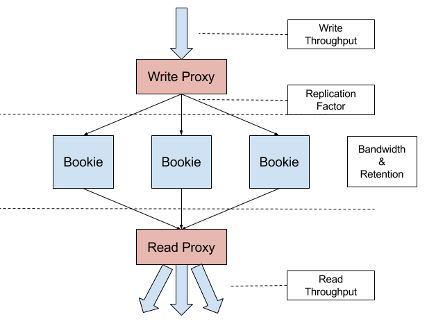

.. contents:: Hardware

Hardware
========

Figure 1 describes the data flow of DistributedLog. Write traffic comes to `Write Proxy`
and the data is replicated in `RF` (replication factor) ways to `BookKeeper`. BookKeeper
stores the replicated data and keeps the data for a given retention period. The data is
read by `Read Proxy` and fanout to readers.

In such layered architecture, each layer has its own responsibilities and different resource
requirements. It makes the capacity and cost model much clear and users could scale
different layers independently.

   Figure 1. DistributedLog Cost Model

Metrics
~~~~~~~

There are different metrics measuring the capability of a service instance in each layer
(e.g a `write proxy` node, a `bookie` storage node, a `read proxy` node and such). These metrics
can be `rps` (requests per second), `bps` (bits per second), `number of streams` that a instance
can support, and latency requirements. `bps` is the best and simple factor on measuring the
capability of current distributedlog architecture.

Write Proxy
~~~~~~~~~~~

Write Proxy (WP) is a stateless serving service that writes and replicates fan-in traffic into BookKeeper.
The capability of a write proxy instance is purely dominated by the *OUTBOUND* network bandwidth,
which is reflected as incoming `Write Throughput` and `Replication Factor`.

Calculating the capacity of Write Proxy (number of instances of write proxies) is pretty straightforward.
The formula is listed as below.

::

    Number of Write Proxies = (Write Throughput) * (Replication Factor) / (Write Proxy Outbound Bandwidth)

As it is bandwidth bound, we'd recommend using machines that have high network bandwith (e.g 10Gb NIC).

The cost estimation is also straightforward.

::

    Bandwidth TCO ($/day/MB) = (Write Proxy TCO) / (Write Proxy Outbound Bandwidth)
    Cost of write proxies = (Write Throughput) * (Replication Factor) / (Bandwidth TCO)

CPUs
^^^^

DistributedLog is not CPU bound. You can run an instance with 8 or 12 cores just fine.

Memories
^^^^^^^^

There's a fair bit of caching. Consider running with at least 8GB of memory.

Disks
^^^^^

This is a stateless process, disk performances are not relevant.

Network
^^^^^^^

Depending on your throughput, you might be better off running this with 10Gb NIC. In this scenario, you can easily achieves 350MBps of writes.

BookKeeper
~~~~~~~~~~

BookKeeper is the log segment store, which is a stateful service. There are two factors to measure the
capability of a Bookie instance: `bandwidth` and `storage`. The bandwidth is majorly dominated by the
outbound traffic from write proxy, which is `(Write Throughput) * (Replication Factor)`. The storage is
majorly dominated by the traffic and also `Retention Period`.

Calculating the capacity of BookKeeper (number of instances of bookies) is a bit more complicated than Write
Proxy. The total number of instances is the maximum number of the instances of bookies calculated using
`bandwidth` and `storage`.

::

    Number of bookies based on bandwidth = (Write Throughput) * (Replication Factor) / (Bookie Inbound Bandwidth)
    Number of bookies based on storage = (Write Throughput) * (Replication Factor) * (Replication Factor) / (Bookie disk space)
    Number of bookies = maximum((number of bookies based on bandwidth), (number of bookies based on storage))

We should consider both bandwidth and storage when choosing the hardware for bookies. There are several rules to follow:
- A bookie should have multiple disks.
- The number of disks used as journal disks should have similar I/O bandwidth as its *INBOUND* network bandwidth. For example, if you plan to use a disk for journal which I/O bandwidth is around 100MBps, a 1Gb NIC is a better choice than 10Gb NIC.
- The number of disks used as ledger disks should be large enough to hold data if retention period is typical long.

The cost estimation is straightforward based on the number of bookies estimated above.

::

    Cost of bookies = (Number of bookies) * (Bookie TCO)

Read Proxy
~~~~~~~~~~

Similar as Write Proxy, Read Proxy is also dominated by *OUTBOUND* bandwidth, which is reflected as incoming `Write Throughput` and `Fanout Factor`.

Calculating the capacity of Read Proxy (number of instances of read proxies) is also pretty straightforward.
The formula is listed as below.

::

    Number of Read Proxies = (Write Throughput) * (Fanout Factor) / (Read Proxy Outbound Bandwidth)

As it is bandwidth bound, we'd recommend using machines that have high network bandwith (e.g 10Gb NIC).

The cost estimation is also straightforward.

::

    Bandwidth TCO ($/day/MB) = (Read Proxy TCO) / (Read Proxy Outbound Bandwidth)
    Cost of read proxies = (Write Throughput) * (Fanout Factor) / (Bandwidth TCO)

