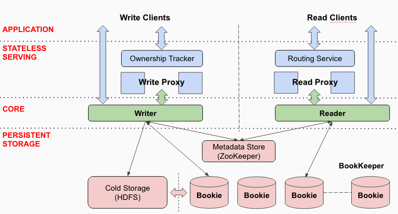
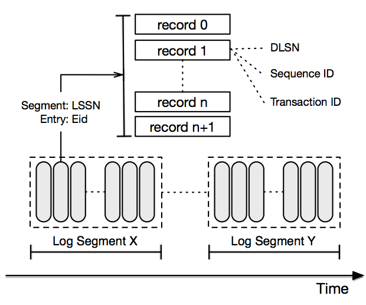

Introduction
============

DistributedLog (DL) is a high performance replicated log service.
It offers durability, replication and strong consistency, which provides a fundamental building block
for building reliable distributed systems, e.g replicated-state-machines, general pub/sub systems,
distributed databases, distributed queues and etc.

DistributedLog maintains sequences of records in categories called *Logs* (aka *Log Streams*).
The processes that write records to a DL log are *writers*, while the processes that read
from logs and process the records are *readers*.

   Figure 1. DistributedLog Software Stack

Logs
----

A **log** is an ordered, immutable sequence of *log records*.

   Figure 2. Anatomy of a log stream

Log Records
~~~~~~~~~~~

Each **log record** is a sequence of bytes.
**Log records** are written sequentially into a *log stream*, and will be assigned with
an unique sequence number *called* **DLSN** (DistributedLog Sequence Number). Besides *DLSN*,
applications could assign its own sequence number while constructing log records. The
application defined sequence number is called **TransactionID** (*txid*). Either *DLSN*
or *TransactionID* could be used for positioning readers to start reading from a specific
*log record*.

Log Segments
~~~~~~~~~~~~

A **log** is broken down into *segments*, which each log segment contains its subset of
records. **Log segments** are distributed and stored in a log segment store (e.g Apache BookKeeper).
DistributedLog rolls the log segments based on configured rolling policy - either a configurable
period of time (e.g. every 2 hours) or a configurable maximum size (e.g. every 128MB).
So the data of logs will be divided into equal-sized *log segments* and distributed evenly
across log segment storage nodes. It allows the log to scale beyond a size that will fit on
a single server and also spread read traffic among the cluster.

The data of logs will either be kept forever until application *explicitly* truncates or be retained
for a configurable period of time. **Explicit Truncation** is useful for building replicated
state machines such as distributed databases. They usually require strong controls over when
the data could be truncated. **Time-based Retention** is useful for real-time analytics. They only
care about the data within a period of time.

Namespaces
~~~~~~~~~~

The *log streams* belong to same organization are usually categorized and managed under
a **namespace**. A DL **namespace** is basically for applications to locate where the
*log streams* are. Applications could *create* and *delete* streams under a namespace,
and also be able to *truncate* a stream to given sequence number (either *DLSN* *TransactionID*).

Writers
-------

Writers write data into the logs of their choice. All the records are
appended into the logs in order. The sequencing is done by the writer,
which means there is only one active writer for a log at a given time.
DL guarantees correctness when two writers attempt writing to
to a same log when network partition happens - via fencing mechanism
in log segment store.

The log writers are served and managed in a service tier called *Write Proxy*.
The *Write Proxy* is used for accepting fan-in writes from large number
of clients. More on **Fan-in and Fan-out** in a second.

Readers
-------

Readers read records from the logs of their choice, starting from a provided
position. The provided position could be either *DLSN* or *TransactionID*.
The readers will read records in strict order from the logs. Different readers
could read records starting from different positions in a same log.

Unlike other pub/sub systems, DistributedLog doesn't record/manage readers' positions.
It leaves the tracking responsibility to applications, as different applications
might have different requirements on tracking and coordinating positions. It is hard
to get it right with a single approach. For example, distributed databases might store
the reader positions along with SSTables, so they would resume applying transactions
from the positions stored in SSTables. Tracking reader positions could easily be done
in application level using various stores (e.g. ZooKeeper, FileSystem, or Key/Value Stores).

The log records could be cached in a service tier called *Read Proxy*, to serve
large number of readers. More on **Fan-in and Fan-out** in a second.

Fan-in and Fan-out
------------------

The core of DistributedLog supports single-writer, multiple-readers semantics. The service layer
built on top of the *DistributedLog Core* to support large scale of number of writers and readers.
The service layer includes **Write Proxy** and **Read Proxy**. **Write Proxy** manages
the writers of logs and fail over them when machines are failed. It allows supporting
which don't care about the log ownership by aggregating writes from many sources (aka *Fan-in*).
**Read Proxy** optimize reader path by caching log records in cases where hundreds or
thousands of readers are consuming a same log stream.

Guarantees
----------

At a high-level, DistributedLog gives the following guarantees:

* Records written by a writer to a log will be appended in the order they are written. That is, if a record *R1* is written by same writer as a record *R2*, *R1* will have a smaller sequence number than *R2*.
* Readers will see records in same order they were written to the log.
* All records were persisted on disks before acknowledges, to gurantee durability.
* For a log with replication factor of N, DistributedLog tolerates up to N-1 server failures without losing any records appended to the log.

More details on these guarantees are given in the design section of this documentation.

