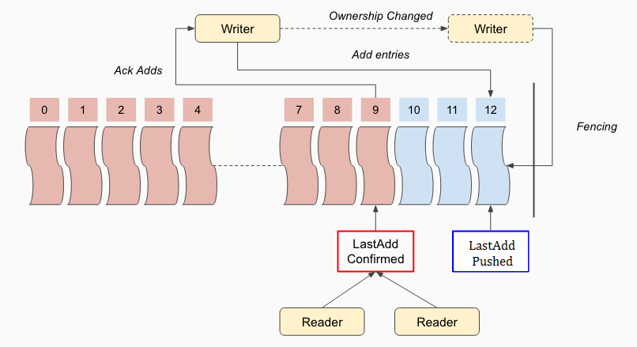

Detail Design
=============

We will describe the design choices that we made while implementing DistributedLog and why we built such layered architecture.

Consistency
-----------

DistributedLog achieves strong consistency, using the `fencing` mechanism provided in the log segment store to guarantee data consistency
and `versioned updates` in the metadata store to guarantee metadata consistency.

LastAddConfirmed
~~~~~~~~~~~~~~~~

DistributedLog leverages bookkeeper’s `LAC` (LastAddConfirmed) protocol - a variation of `two-phase-commit` algorithm to build its data pipeline
and achieve consistency around it. Figure 1 illustrates the basic concepts of this protocol.

   Figure 1. Consistency in Log Segment Store

Each batched entry appended to a log segment will be assigned a monotonically increasing entry id by the log segment writer. All the entries are
written asynchronously in a pipeline. The log segment writer therefore updates an in-memory pointer, called `LAP` (LastAddPushed), which is the
entry id of the last batched entry pushed to log segment store by the writer. The entries could be written out of order but only be acknowledged
in entry id order. Along with the successful acknowledges, the log segment writer also updates an in-memory pointer, called `LAC` (LastAddConfirmed).
LAC is the entry id of the last entry that already acknowledged by the writer. All the entries written between LAC and LAP are unacknowledged data,
which they are not visible to readers. 

The readers can read entries up to LAC as those entries are known to be durably replicated - thereby can be safely read without the risk of violating
read ordering. The writer includes the current LAC in each entry that it sends to BookKeeper. Therefore each subsequent entry makes the records in
the previous entry visible to the readers. LAC updates can be piggybacked on the next entry that are written by the writer. Since readers are strictly
followers, they can leverage LAC to read durable data from any of the replicas without need for any communication or coordination with the writer.

DL introduces one type of system record, which is called `control record` - it acts as the `commit` request in `two-phases-commit` algorithm.
If no application records arrive within the specified SLA, the writer will generate a control record. With writing the control record, it would advance
the LAC of the log stream. The control record is added either immediately after receiving acknowledges from writing a user record or periodically if
no application records are added. It is configured as part of writer’s flushing policy. While control log records are present in the physical log stream,
they are not delivered by the log readers to the application.

Fencing
~~~~~~~

LAC is a very simple and useful mechanism to guarantee consistency across readers. But it is not enough to guarantee correctness when the ownership
of a log stream is changed - there might be multiple writers exist at the same time when network partition happens. DistributedLog addresses this by `fencing`
data in log segment store and conditionally (via versioned set) updating log segment metadata in metadata store. Fencing is a built-in mechanism in bookkeeper - when
a client wants to fence a ledger, it would send a special fence request to all the replicas of that ledger; the bookies that host that ledger will change the state of
that ledger to fenced. once a ledger’s state is changed to fenced, all the write attempts to it would be failed immediately. Client claims a success fence when
it receives successful fence responses from majorities of the replicas.

Figure 2 illustrates how does DistributedLog work when ownership is changed for a log stream.

   Figure 2. Fencing & Consistency

Whenever the ownership is changed from one writer to the other writer (step 0), the new owner of the log stream will first retrieve the list of log segments of
that log stream along with their versions (the versions will used for versioned set on updating log segments’ metadata). The new owner will find current inprogress
log segment and recover the log segment in following sequence:

1. It would first fence the log segment (step 2.1). Fencing successfully means no writes will succeed any more after that. 
2. If the old owner is just network partitioned, it might still think itself is the owner and keep adding records to that log segment.  But because the log segment has been fenced, so all writes by the old owner will be rejected and failed (step 2.2). The old owner will realize that it already lost the ownership and gave up.
3. Once the log segment is fenced, the new owner will proceed a recovery process to recover the log segment. Once the log segment is recovered, it would issue a versioned set operation to metadata store to convert the log segment status from inprogress to completed (step 2.3).
4. A new inprogress log segment will be created by the new writer to continue writing to this log stream (step 3).

Completing an inprogress log segment and creating a new log segment could be executed in parallel to achieve fast log stream recovery. It will reduce the latency
penalty for writes during ownership changed.

Creating a new log segment during ownership change is known as ‘*obtaining an epoch during leader election*’ in distributed consensus algorithms. It makes clean 
implementation for a replicated log service, as the client that lost the ownership (aka mastership, lock) doesn’t even know the identity of the new epoch (in DL,
it is the new log segment id) so it can’t accidentally write to the new log segment. We leverage zookeeper’s sequential znode on generating new log segment id.

Ownership Tracking
~~~~~~~~~~~~~~~~~~

With the built-in fencing mechanism in storage layer and metadata updates, DistributedLog doesn’t require strict leader election
to guarantee correctness. Therefore we use ‘`ownership tracking`’ as opposed to ‘`leader election`’ for the log stream ownership management.

DistributedLog uses ZooKeeper ephemeral znodes for tracking the ownerships of log streams. Since ZooKeeper already provides `sessions` that
can be used to track leases for failure detection. In production environment, we tuned the zookeeper settings to ensure failures could be
detected within one second. An aggressive bound on failure detection increases the possibility of false positives. If ownerships flap between
write proxies, delays will result from writes blocking for log stream recovery. `Deterministic routing` allows multiple clients to choose the
same write proxy to fail over when the current owner proxy is unavailable. The details are described in Figure 3. 

   Figure 3. Request Routing

Applications write the log records by the write client. Write client will first look up the `ownership cache`, a local cache that caches mapping
between log stream name and its corresponding log stream owner. If the stream is not cached yet, the client will use consistent hashing based
`routing service` to compute a candidate write proxy (step 1.1) and then send the write request to this candidate write proxy (step 1.2). If it
already owns the log stream or it could successfully claim the ownership, it would satisfy the write request and respond back to the client (step 1.3).
If it can’t claim the ownership, it then send the response back to the client to ask it redirect to the right owner (1.4). All succeed write requests
will keep the local ownership cache up-to-date, which help avoiding the subsequent requests being redirected.

Streaming Reads
---------------

After the readers have caught up to the current tail of the log, DistributedLog provides readers the ability to read new log records as they are
published - a mechanism commonly known as `tailing` the log. Readers start out by **positioning** to a record in the log stream based on either DLSN or
Transaction ID. The reader starts **reading** records until it reaches the tail of the log stream. Once it has caught up with the writer, the reader waits
for **notifications** about new log records or new log segments.

Positioning
~~~~~~~~~~~

As mentioned above, there are 3 types of sequence numbers are associated with a log record. Except sequence id is computed at reading time, both DLSN (implicit)
and Transaction ID (explicit) are attached to log records in writing time. Applications could use either of them for positioning. DLSN is the best sequence number
on positioning, as it already tells which log segment, which entry and which slot of the record in the log stream. No additional search operations are required.
While Transaction ID is assigned by applications, positioning a reader by transaction id will first look up the list of log segments to find which log segment
contains the given transaction id and then look up the records in the found log segment to figure out the actual position within that log segment.
Both looking up in the log segment list and the found log segment use binary search to speed up the searching. Although positioning by transaction id could be a
bit slower than positioning by DLSN, it is useful for analytics workloads to rewind to analyze old data in hours if the transaction id is timestamp.

Reading
~~~~~~~

Figure 4 illustrates reading batched entries from log segment store. The are two basic read operations: read a given entry by entry id (a) and read LAC (b). 

.. figure:: ../images/readrequests.png
   :align: center

   Figure 4. Read entries from log segment store

Since an entry is immutable after it is appended to a log segment, reading a given entry by entry id could go to any replicas of that log segment and retry others
if encountered failures. In order to achieve low predictable 99.9 percentile latency even during bookie failures, a **speculative** read mechanism is deployed:
a read request will be sent to first replica; if client doesn’t receive the response with a speculative timeout, it would send another request to second replica;
then wait for the responses of both first replica and second replica; and so forth until receiving a valid response to complete the read request or timeout.

Reading LAC is an operation for readers to catch up with the writer. It is typically a quorum-read operation to guarantee freshness: the client sends the read requests
to all replicas in the log segment and waits for the responses from the majority of them. It could be optimized to be a best-effort quorum-read operation for tailing reads,
which it doesn’t have to wait for quorum responses from the replicas and could return whenever it sees an advanced LAC.

`Figure 4(c)` illustrates the third type of read request, which is called `“Long Poll Read”`. It is a combination of (a) and (b), serving the purpose of
reading next available entry in the log segment. The client sends a long poll read request along with next read entry id to the log segment store.
If the log segment store already saw the entry and it is committed (entry id is not greater than LAC), it responds the request immediately with latest LAC
and requested entry. Otherwise, it would wait for LAC being advanced to given entry id and respond back requested entry. Similar speculative mechanism is
deployed in long polling to achieve predictable low 99.9 percentile latency.

Notifications
~~~~~~~~~~~~~

Once the reader is caught up with the writer, it would turn itself into `‘notification’` mode. In this mode, it would wait notifications of new records
by `long polling` reads (described above) and `notification` of state changes of log segments. The notification mechanism for state changes of log segments
is provided by Metadata Store. Currently it is ZooKeeper watcher. The notifications are triggered when an inprogress log segment is completed or a new inprogress
log segment is created.

ReadAhead
~~~~~~~~~

The reader will read ahead to proactively bring new data into cache, for applications to consume. It helps reducing the read latency as it proactively brings newer
data into cache while applications consuming them. DistributedLog uses LAC as an indicator to detect if a reader is still catching up or already caught up and
adjusting the readahead pace based on the reader state and its consuming rate.

LogSegment Lifecycle
--------------------

DistributedLog breaks a log stream down into multiple log segments based configured rolling policy. The current inprogress log segment will be completed
and a new log segment will be created when either the log segment has been written for more than a configured rolling interval (aka time-based rolling),
the size of the log segment has reached a configured threshold (aka size-based rolling), or whenever the ownership of a log stream is changed.

A new log segment is created in `Inprogress` state. It is completed as a `Completed` log segment when either the writer rolls into a new log segment or
recovered when ownership changed. Once the log segment is completed, it will be truncated later either by `explicit truncation` or `expired due to TTL timeout`.
The log segment will be marked as `Partial Truncated` along with a `Min-Active-DLSN` pointer when only portion of its data is truncated, and `Truncated` when
the `Min-Active-DLSN` pointer reaches the end of the log segment. The truncated log segments will be moved to Cold Storage for longer retention or backup for
disaster recovery, and eventually be deleted after TTL expiration. Figure 5 illustrates a log stream that contains 5 log segments which each of them are in
different states. The dot line describes the transition between states.

   Figure 5. The lifecycle of log segments

Distribution
~~~~~~~~~~~~

A log segment is placed on multiple log segment storage nodes according configured placement policy. DistributedLog uses a `rack-aware` placement policy on
placing log segments in a local datacenter setup, which the rack-aware placement policy will guarantee all the replicas of same log segment placed in
different racks for network fault-tolerance. It uses a `region-aware` placement policy on placing log segments among multiple datacenters for a global setup
(see more in section `“Global Replicated Log”`), which guarantees all the replicas of same log segment placed in multiple datacenters and ensures receiving
acknowledges from majority of the data centers.

As DistributedLog breaks down the streams into multiple log segments, the log segments could be evenly distributed across multiple log segment storage nodes
for load balancing. It helps the data distribution balancing and read workload balancing. Figure 6 shows an example how the data of 2 streams (*x*, *y*) is
stored as 3 replicas in a *5-nodes* cluster in a balanced way.
 

   Figure 6. Log Segment Distribution Example

Truncation
~~~~~~~~~~

As the writers keep writing records into the log streams, the data will be accumulated. In DistributedLog,
there are two ways to delete old data, one is `Explicit Truncation` while the other is `TTL Expiration`. 

Applications are allowed to explicitly truncate a log stream to a given DLSN. Once the truncation request is
received by the writer, the writer will mark all the log segments whose log segment sequence number is less than 
the sequence number of that DLSN as `Truncated`. The log segment segment whose sequence number is same as that 
DLSN will be marked as `Partially Truncated` along and the DLSN as the last active DLSN. So positioning the reader 
will be advanced to last active DLSN if the provided position is already truncated. All the truncated log segments 
will be still kept for a configured time period for disaster recovery and the actual log segments will be deleted 
and garbage collected via `TTL Expiration`.

When a log segment is completed, the completion time will be recorded as part of the log segment metadata. 
DistributedLog uses `completion time` for TTL Expiration: all the log segments whose completion time already 
passed the configured TTL period will be deleted from metadata store. After the log segments are deleted from 
metadata store, the log segments will be garbage collected from log segment store and their disk spaces will be 
reclaimed.
